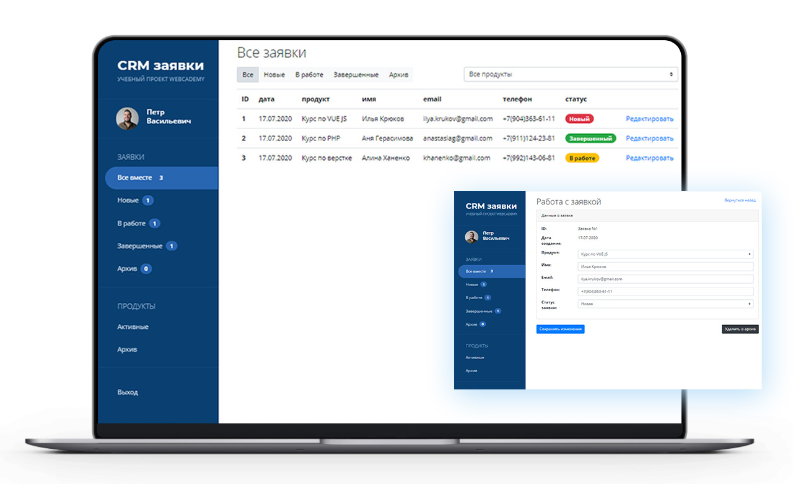

# CRM система для учета заявок
<p>
	
</p>

### Функционал

* Добавление заявок
* Отображение заявок
* Фильтрация и выборка элементов списка
* Возможность редактирования заявок

### Особенности

* Native js
* MVC архитектура проекта
* Реализация на модулях ES5
* Работа с формами отправки данных
* Валидация форм в JS. Маска для номера телефона.
* Работа с localStorage


###  [**Онлайн демо**](https://anastasiagerasimova.github.io/crm-js/)

### Тестировать локально

```
git clone https://github.com/anastasiagerasimova/crm-js.git
```

Открыть index.html
